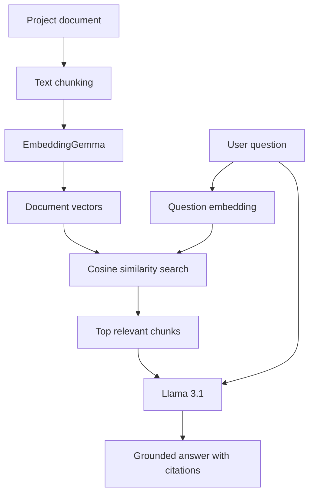

# AI Delivery Intelligence Copilot

A local-first Retrieval-Augmented Generation (RAG) chatbot that analyzes project-delivery documents and produces evidence-based answers with source citations.

The project combines hands-on Generative AI engineering with practical project and program-management use cases such as RAID analysis, dependency tracking, delivery-status reporting, and decision support.

## Why This Project?

Project information is often distributed across status reports, RAID logs, meeting notes, and delivery documents. Finding the latest risk, owner, deadline, or decision can require manually reviewing several sources.

The AI Delivery Intelligence Copilot retrieves relevant project information and asks a locally running Large Language Model to answer using only the retrieved evidence.

## Current Capabilities

- Runs completely locally using Ollama
- Uses `llama3.1:8b` for answer generation
- Uses `embeddinggemma` for text embeddings
- Splits project documents into searchable chunks
- Performs semantic search using cosine similarity
- Retrieves the most relevant source passages
- Generates source-grounded answers
- Preserves names, dates, amounts, and project identifiers
- Refuses questions when the document lacks sufficient information
- Displays retrieval similarity scores for transparency
- Supports interactive questions from the command line

## Example

**Question**

```text
What is threatening the performance testing schedule,
who owns it, and what mitigation is planned?
```

**Grounded answer**

```text
The external performance-test environment may not be available by
September 12, threatening the performance testing schedule. Ravi Kumar
owns the risk. The mitigation is to arrange a temporary cloud-based test
environment by September 8 [SOURCE 1].
```

## RAG Architecture



## How RAG Works in This Project

1. The application loads a project document.
2. The document is divided into paragraph-sized chunks.
3. EmbeddingGemma converts every chunk into a numerical vector.
4. The user’s question is converted into another vector.
5. Cosine similarity identifies the chunks closest to the question.
6. The most relevant chunks are supplied to Llama 3.1 as context.
7. The model answers using only that context and cites its evidence.

## Technology Stack

| Area | Technology |
|---|---|
| Programming language | Python 3.12 |
| Local LLM runtime | Ollama |
| Generation model | Llama 3.1 8B |
| Embedding model | EmbeddingGemma |
| Numerical processing | NumPy |
| Retrieval method | Cosine similarity |
| Version control | Git and GitHub |

## Project Structure

```text
rag-chatbot/
├── data/
│   └── sample_project_status.txt
├── app.py
├── rag_demo.py
├── requirements.txt
├── .gitignore
└── README.md
```

## Local Setup

### Prerequisites

- Python 3.12
- Git
- Ollama

### Download the models

```bash
ollama pull llama3.1:8b
ollama pull embeddinggemma
```

### Clone the repository

```bash
git clone https://github.com/saiHub108/rag-chatbot.git
cd rag-chatbot
```

### Create a virtual environment

Windows:

```bat
py -3.12 -m venv .venv
.venv\Scripts\activate
```

macOS or Linux:

```bash
python3.12 -m venv .venv
source .venv/bin/activate
```

### Install dependencies

```bash
python -m pip install -r requirements.txt
```

### Run the basic LLM example

```bash
python app.py
```

### Run the RAG chatbot

```bash
python rag_demo.py
```

Enter a question when prompted.

## Responsible AI Measures

The current implementation:

- Instructs the model to use only retrieved evidence
- Requires exact preservation of dates, names, amounts, and identifiers
- Provides source citations
- Refuses to invent an answer when information is unavailable
- Uses fictional sample project data to prevent disclosure of confidential information

## Learning and Quality Findings

During development, the model initially confused two retrieved dates:

- Risk date: September 12
- Mitigation deadline: September 8

The grounding prompt was strengthened and deterministic generation was enabled with a temperature of zero. The corrected response preserved both dates accurately.

This example demonstrates why successful retrieval alone does not guarantee a factually correct RAG answer. Retrieval and generation must both be evaluated.

## Roadmap

- [x] Local LLM integration
- [x] Local embedding generation
- [x] Semantic retrieval
- [x] Source-grounded responses
- [x] Missing-context refusal
- [x] Interactive command-line questions
- [ ] Automated RAG evaluation suite
- [ ] PDF and DOCX document ingestion
- [ ] Persistent vector database
- [ ] FastAPI backend
- [ ] React user interface
- [ ] RAID extraction using structured output
- [ ] Hybrid search and reranking
- [ ] Conversation memory
- [ ] Prompt-injection protection
- [ ] AI observability and performance metrics
- [ ] Docker packaging
- [ ] GitHub Actions CI pipeline
- [ ] Cloud-hosted demonstration

## Planned Business Use Cases

- Identify risks that threaten release dates
- Find overdue project dependencies
- Generate executive status summaries
- Extract RAID entries from meeting notes
- Compare delivery reports across reporting periods
- Identify contradictory project information
- Support evidence-based release-readiness decisions

## Data Privacy

The included project document is entirely fictional and was created for demonstration purposes. Do not commit confidential organizational or client documents to a public repository.

## Author

**Sai Burgula**

Project Manager, Technical Program Manager and Agile Delivery Leader developing hands-on expertise in Generative AI, RAG and AI-enabled delivery solutions.